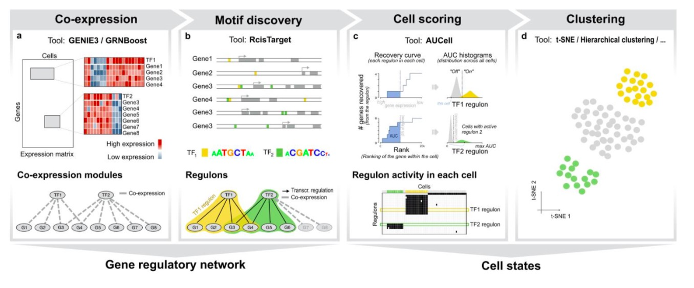
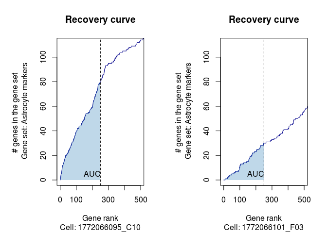

# SCENIC

## Workflow

## Co-expression
The co-expression network was inferred with **GENIE3** or **GRNBoost** (scalable version with Spark).

**Reference:**

## Motif discovery (RcisTarget)

## Cell scoring (AUCell)
### Building rankings
The first step is to rank the genes in each cell according to their expression level from highest to lowest. It is important to check that most cells have at least the number of expressed/detected genes that are going to be used to calculate the AUC. The dataset from different cells should be similar in gene sensitivity, meaning that similar number of genes and gene IDs.

### Calculate the AUC of target gene set
To access whether a target gene set, which is the genes in a specific regulatory network here, is enriched in the highest expressed genes in the dataset, AUCell uses the “Area Under the Curve” (AUC) of the recovery curve.

### Set the asignment threshold based on AUC distribution
